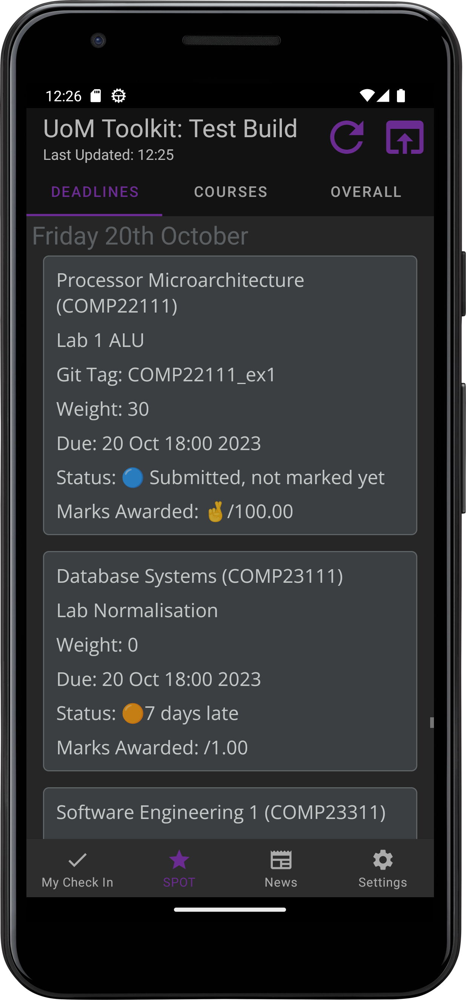

# UoM-Toolkit
An android app designed for CS students at UoM to make using the Uni's services less painful.

## MyCheckIn

Be notified of lectures, workshops, and labs, and check into them without having to sign in every damn time.

 

## SPOT

View your deadlines in a linear fashion that is not incomprehensible

  

## News

Get all of your University related news in one place, with the default sources being the CS department, BBC Manchester, and UoM's news site.

 

## Embedded Browser

Tired of signing in every five minutes? UoM Toolkit has you covered, UoM toolkit can use the authentication cookies used to access MyCheckIn and SPOT to automatically sign you in on the integrated browser.

     

## Where is it?

Unfortunately this repository is currently a placeholder as the code is undergoing a massive refactor as the feature creep got way too real and time started running out. It really doesn't help that a lot of UoM's services such as MyCheckIn are still down months after the cyber attack, making development tricky.

If months have gone by and I still haven't uploaded anything, feel free to bother me about it, because this thing is way too cool to leave unfinished :)